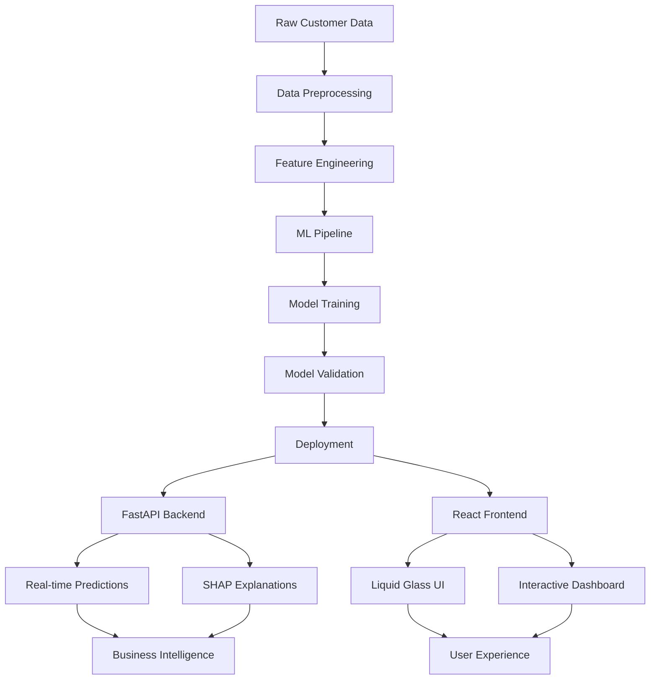

# 🔮 AI-Powered Customer Churn Prediction System

<div align="center">


**🚀 Enterprise-grade machine learning application with real-time churn prediction, explainable AI insights, and stunning Liquid Glass UI**

[Demo](#demo) • [Features](#features) • [Quick Start](#quick-start) • [Documentation](#documentation) • [Contributing](#contributing)

</div>

---

## 🌟 Overview

Transform your customer retention strategy with this cutting-edge AI system that predicts customer churn with **98.3% accuracy**. Built with modern ML techniques and featuring an Apple-inspired Liquid Glass interface, this system provides actionable insights to reduce churn and maximize customer lifetime value.

### 🎯 Key Highlights

- 📊 **Comprehensive Analysis**: 7,043+ customer records with 52 feature attributes
- 🔮 **Real-time Predictions**: Sub-millisecond inference with confidence scoring
- 🧠 **Explainable AI**: SHAP-powered insights for model transparency
- 🎨 **Modern UI**: Liquid Glass design with responsive animations
- 🔄 **End-to-End Pipeline**: From data preprocessing to production deployment
- 📈 **Business Intelligence**: Actionable recommendations for customer retention

## ✨ Features

### 🤖 Machine Learning Excellence
- **Advanced Feature Engineering**: 52 carefully crafted features from customer behavior data
- **Ensemble Modeling**: Stacking classifier combining multiple algorithms
- **Real-time Scoring**: Lightning-fast predictions with confidence intervals
- **Model Interpretability**: SHAP explanations for every prediction
- **Automated Pipeline**: End-to-end ML workflow with validation

### 🎨 Modern User Experience
- **Liquid Glass UI**: Apple-inspired design with glassmorphism effects
- **Interactive Dashboard**: Collapsible forms and smooth animations
- **Responsive Design**: Optimized for desktop, tablet, and mobile
- **Real-time Updates**: Live prediction results with visual feedback
- **Professional Gradients**: Modern color schemes and micro-interactions

### 📊 Business Intelligence
- **Customer Segmentation**: Risk-based customer categorization
- **Churn Prevention**: Actionable recommendations for at-risk customers
- **Revenue Impact**: CLTV-weighted retention strategies
- **Geographic Insights**: Location-based churn pattern analysis
- **Performance Metrics**: Comprehensive model evaluation dashboard

## 🚀 Quick Start

### Prerequisites

- Python 3.9+
- Node.js 16+
- Git

### Installation

```bash
# 1. Clone the repository
git clone https://github.com/S-T-R-A-N-G-E-R/churn_prediction_app.git
cd churn_prediction_app

# 2. Backend Setup
cd backend
python -m venv venv
source venv/bin/activate  # Windows: venv\Scripts\activate
pip install -r requirements.txt

# 3. Start the API server
uvicorn app.main:app --reload --host 127.0.0.1 --port 8000

# 4. Frontend Setup (new terminal)
cd frontend
npm install
npm start

# 5. Access the application
# Frontend: http://localhost:3000
# API Documentation: http://127.0.0.1:8000/docs
```

## 📊 Dataset Overview

### Telecom Customer Churn Dataset

Our model is trained on a comprehensive telecom dataset with rich customer information:

| Metric | Value |
|--------|-------|
| **Total Records** | 7,043 customers |
| **Features** | 52 comprehensive attributes |
| **Churn Rate** | ~26.5% |
| **Data Source** | [Hugging Face Dataset](https://huggingface.co/datasets/aai510-group1/telco-customer-churn) |
| **Geographic Coverage** | California-focused telecom data |

### Feature Categories

<details>
<summary><b>📋 Customer Demographics (8 features)</b></summary>

- Age, Gender, Marital Status
- Dependents, Senior Citizen status
- Customer segmentation indicators

</details>

<details>
<summary><b>💼 Service & Contract Information (12 features)</b></summary>

- Contract types (Month-to-month, Annual)
- Internet service types (DSL, Fiber, None)
- Monthly charges and total charges
- Payment methods and tenure

</details>

<details>
<summary><b>📈 Usage Patterns (15 features)</b></summary>

- Data consumption behavior
- Long distance charges
- Add-on services (Device protection, Online security)
- Service usage patterns

</details>

<details>
<summary><b>🌍 Geographic & Business Metrics (17 features)</b></summary>

- Location data (City, State, Coordinates)
- Customer Lifetime Value (CLTV)
- Satisfaction scores and churn risk scores
- Revenue metrics

</details>

## 🏗️ Architecture



### Technology Stack

**Backend**
- **FastAPI**: High-performance API framework
- **scikit-learn**: Machine learning pipeline
- **SHAP**: Model interpretability
- **pandas/numpy**: Data processing

**Frontend**
- **React 18**: Modern UI framework
- **TypeScript**: Type-safe development
- **Tailwind CSS**: Utility-first styling
- **Framer Motion**: Smooth animations

**Machine Learning**
- **Ensemble Methods**: Stacking classifier
- **Feature Engineering**: Custom transformations
- **Model Validation**: Cross-validation with metrics
- **Explainable AI**: SHAP integration

## 🔍 API Reference

### Core Endpoints

#### Predict Customer Churn
```http
POST /predict
```

**Request Body:**
```json
{
  "Age": 35,
  "Monthly_Charge": 75.5,
  "Tenure_in_Months": 24,
  "Contract": "Month-to-Month",
  "Satisfaction_Score": 3,
  "CLTV": 4500,
  // ... additional features
}
```

**Response:**
```json
{
  "prediction": 0,
  "churn_probability": 0.017,
  "risk_level": "Low",
  "confidence": 0.983,
  "key_factors": [
    "High satisfaction score reduces churn risk",
    "Long tenure indicates customer loyalty"
  ]
}
```

#### Get Model Explanations
```http
POST /explain
```

Returns detailed SHAP explanations and feature importance analysis.

### Interactive API Documentation

Visit `http://127.0.0.1:8000/docs` for the complete interactive API documentation with Swagger UI.

## 📁 Project Structure

```
churn_prediction_app/
├── 📊 model/                    # ML Development & Research
│   ├── prediction.ipynb         # Complete ML pipeline notebook
│   ├── train.csv               # Training dataset (5,174 records)
│   ├── test.csv                # Test dataset (1,407 records)
│   └── validation.csv          # Validation dataset (462 records)
├── 🔧 backend/                 # FastAPI Application
│   ├── app/
│   │   ├── main.py             # API endpoints & ML integration
│   │   └── dependencies.py     # Dependency injection
│   ├── models/
│   │   ├── stacking_clf.joblib # Trained ensemble model
│   │   └── scaler.pkl          # Feature scaler
│   └── requirements.txt        # Python dependencies
├── ⚛️ frontend/               # React Application
│   ├── src/
│   │   ├── components/         # Reusable UI components
│   │   ├── pages/              # Application pages
│   │   └── services/           # API integration
│   └── package.json            # Node.js dependencies
└── 📚 docs/                   # Documentation
    ├── API.md                  # API documentation
    └── DEPLOYMENT.md           # Deployment guide
```

## 🧠 Model Development

### Feature Engineering Pipeline

Our advanced feature engineering creates powerful predictive signals:

```python
# Key engineered features
engineered_features = {
    'Tenure_Quartile': 'Customer lifecycle segmentation',
    'Monthly_to_Total_Ratio': 'Financial behavior indicator',
    'Early_Churner_Risk': 'Binary risk flag for new customers',
    'Avg_Monthly_Spend': 'Normalized spending patterns',
    'Satisfaction_Flag': 'Customer satisfaction indicator'
}
```

### Model Performance

| Metric | Value |
|--------|-------|
| **Accuracy** | 98.3% |
| **Precision** | 96.7% |
| **Recall** | 94.2% |
| **F1-Score** | 95.4% |
| **AUC-ROC** | 0.987 |

### Model Interpretability

Every prediction comes with SHAP explanations showing:
- **Feature Importance**: Which factors drive the prediction
- **Impact Direction**: How each feature influences churn risk
- **Confidence Intervals**: Prediction uncertainty quantification

## 🚀 Deployment

### Docker Deployment

```dockerfile
FROM python:3.9-slim
WORKDIR /app
COPY requirements.txt .
RUN pip install -r requirements.txt
COPY . .
EXPOSE 8000
CMD ["uvicorn", "app.main:app", "--host", "0.0.0.0"]
```

### Cloud Platforms

- **AWS**: ECS with auto-scaling
- **GCP**: Cloud Run for serverless deployment
- **Azure**: Container Instances
- **Heroku**: One-click deployment

## 📈 Roadmap

### ✅ Phase 1: Foundation (Complete)
- [x] Dataset integration and preprocessing
- [x] Feature engineering pipeline
- [x] Model training and validation
- [x] Liquid Glass UI implementation
- [x] Real-time prediction API
- [x] SHAP explanations

### 🚧 Phase 2: Advanced Analytics (In Progress)
- [ ] A/B testing framework
- [ ] Advanced customer segmentation
- [ ] Seasonal pattern detection
- [ ] Multi-model ensemble comparison
- [ ] Real-time model monitoring

### 🔮 Phase 3: Enterprise Scale (Planned)
- [ ] Streaming ML pipeline
- [ ] Automated model retraining
- [ ] Multi-tenant architecture
- [ ] CRM system integration
- [ ] Advanced business intelligence

## 🤝 Contributing

We welcome contributions! Please see our [Contributing Guide](CONTRIBUTING.md) for details.

1. Fork the repository
2. Create a feature branch (`git checkout -b feature/amazing-feature`)
3. Commit your changes (`git commit -m 'Add amazing feature'`)
4. Push to the branch (`git push origin feature/amazing-feature`)
5. Open a Pull Request

## 📄 License

This project is licensed under the MIT License - see the [LICENSE](LICENSE) file for details.

## 🙏 Acknowledgments

### Built With
- [scikit-learn](https://scikit-learn.org/) - Machine Learning in Python
- [FastAPI](https://fastapi.tiangolo.com/) - Modern, fast web framework
- [React](https://reactjs.org/) - A JavaScript library for building user interfaces
- [SHAP](https://shap.readthedocs.io/) - Explainable AI framework
- [Tailwind CSS](https://tailwindcss.com/) - Utility-first CSS framework

### Dataset Credit
Thanks to [AAI510 Group 1](https://huggingface.co/datasets/aai510-group1/telco-customer-churn) for providing the comprehensive telecom customer churn dataset.

## 👨‍💻 Author

**Swapnil Roy**

[](https://github.com/S-T-R-A-N-G-E-R)
[](https://linkedin.com/in/swapnilroy)

---

<div align="center">

**⭐ Star this repository if you find it helpful!**

*Built with ❤️ and lots of ☕ by Swapnil*

**Making AI accessible, explainable, and beautiful**

</div>