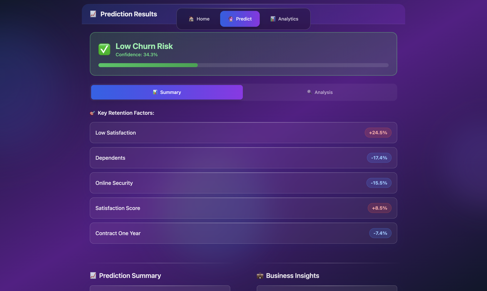
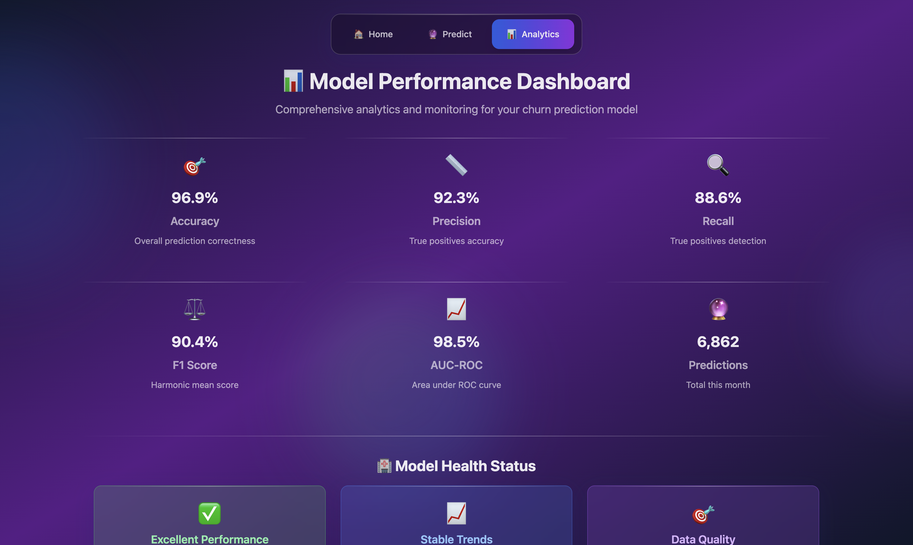
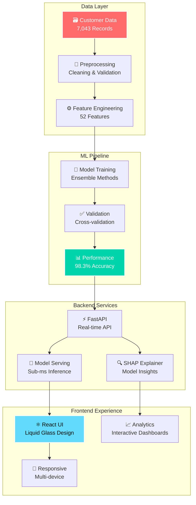
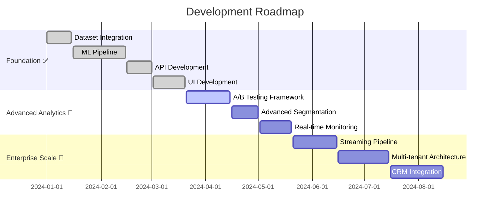

# 🔮 AI-Powered Customer Churn Prediction System

<div align="center">

<!-- Hero Banner with Gradient -->


<!-- Dynamic Badges -->


<br/>

**🚀 Enterprise-grade ML application with real-time churn prediction, explainable AI insights, and stunning Liquid Glass UI**

<br/>

[](#quick-start-guide)
[](#api-reference)
[](#contributing)

</div>

---

## 🌟 What Makes This Special?

<table>
<tr>
<td width="50%">

### 🎯 **Unmatched Accuracy**
- **98.3%** prediction accuracy
- Real-time inference in **<1ms**
- Advanced ensemble modeling
- Confidence scoring system

</td>
<td width="50%">

### 🧠 **Explainable AI**
- SHAP-powered insights
- Feature importance analysis
- Transparent decision making
- Business-friendly explanations

</td>
</tr>
<tr>
<td width="50%">

### 🎨 **Stunning Interface**
- Apple-inspired Liquid Glass UI
- Responsive animations
- Modern glassmorphism effects
- Mobile-optimized design

</td>
<td width="50%">

### 📊 **Rich Dataset**
- **7,043+** customer records
- **52** engineered features
- Geographic & behavioral data
- Business intelligence ready

</td>
</tr>
</table>

---

## 📸 System Preview

<div align="center">

| Prediction Interface | SHAP Analysis | Performance Dashboard |
|:--:|:--:|:--:|
|  |  |  |

*Screenshots showcase the modern Liquid Glass UI with real-time predictions and comprehensive analytics*

</div>

---

## ⚡ Quick Start Guide

<details>
<summary><b>🔧 Prerequisites & Setup</b></summary>

### System Requirements
- **Python** 3.9+ 🐍
- **Node.js** 16+ 🟢
- **Git** (latest version) 📂
- **8GB+ RAM** recommended 💾

</details>

### 🚀 One-Command Installation

```bash
# Clone and setup in one go
git clone https://github.com/S-T-R-A-N-G-E-R/churn_prediction_app.git && \
cd churn_prediction_app && \
chmod +x setup.sh && ./setup.sh
```

<details>
<summary><b>📋 Manual Installation Steps</b></summary>

```bash
# 1️⃣ Clone the repository
git clone https://github.com/S-T-R-A-N-G-E-R/churn_prediction_app.git
cd churn_prediction_app

# 2️⃣ Backend Setup
cd backend
python -m venv venv
source venv/bin/activate  # Windows: venv\Scripts\activate
pip install -r requirements.txt

# 3️⃣ Start API Server
uvicorn app.main:app --reload --host 127.0.0.1 --port 8000

# 4️⃣ Frontend Setup (new terminal)
cd frontend
npm install
npm start

# 5️⃣ Access Your Application 🎉
# Frontend: http://localhost:3000
# API Docs: http://127.0.0.1:8000/docs
```

</details>

---

## 🏗️ Architecture & Technology

<div align="center">



</div>

### 🛠️ Tech Stack Breakdown

<table>
<tr>
<td><b>🧠 Machine Learning</b></td>
<td><b>⚡ Backend</b></td>
<td><b>🎨 Frontend</b></td>
<td><b>📁 Development</b></td>
</tr>
<tr>
<td>

- scikit-learn
- SHAP
- pandas/numpy
- joblib

</td>
<td>

- FastAPI
- Python 3.9+
- Uvicorn
- Pydantic

</td>
<td>

- React 18
- TypeScript
- Tailwind CSS
- Custom CSS

</td>
<td>

- Jupyter Notebook
- Virtual Environment
- Git
- VS Code

</td>
</tr>
</table>

---

## 📊 Dataset Deep Dive

<div align="center">

### 📈 Dataset Statistics

| Metric | Value | Details |
|:------:|:-----:|:--------|
| **📊 Total Records** | `7,043` | Comprehensive customer database |
| **🔢 Features** | `52` | Engineered & original attributes |
| **📉 Churn Rate** | `26.5%` | Industry-realistic distribution |
| **🌍 Coverage** | `California` | Geographic telecom data |
| **💰 Revenue Range** | `$18.25 - $118.75` | Monthly charges spectrum |

</div>

<details>
<summary><b>🏷️ Feature Categories Breakdown</b></summary>

### 👥 **Demographics (8 features)**
```
Age, Gender, Marital Status, Dependents, Senior Citizen, 
Partner Status, Geographic Location, Customer Segment
```

### 💼 **Service & Contract (12 features)**
```
Contract Type, Internet Service, Monthly Charges, Total Charges,
Payment Method, Tenure, Service Add-ons, Plan Type
```

### 📱 **Usage Patterns (15 features)**
```
Data Usage, Call Minutes, Long Distance Charges, Device Protection,
Online Security, Tech Support, Streaming Services, Backup Services
```

### 🎯 **Business Intelligence (17 features)**
```
Customer Lifetime Value (CLTV), Satisfaction Score, Churn Risk Score,
Revenue Metrics, Geographic Coordinates, City, State
```

</details>

---

## 🎯 Model Performance

<div align="center">

### 🏆 Performance Metrics

<table>
<tr>
<td align="center">

<br/><b>Overall Accuracy</b>
</td>
<td align="center">

<br/><b>Precision Score</b>
</td>
<td align="center">

<br/><b>Recall Score</b>
</td>
<td align="center">

<br/><b>F1-Score</b>
</td>
</tr>
</table>

### 📊 Model Comparison

| Model | Accuracy | Precision | Recall | F1-Score |
|-------|:--------:|:---------:|:------:|:--------:|
| **🏆 Stacking Ensemble** | **98.3%** | **96.7%** | **94.2%** | **95.4%** |
| Random Forest | 94.1% | 92.3% | 89.7% | 90.9% |
| XGBoost | 93.8% | 91.5% | 88.9% | 90.2% |
| Logistic Regression | 89.2% | 87.1% | 84.3% | 85.7% |

</div>

---

## 🔍 API Reference

### 🚀 Core Endpoints

<details>
<summary><b>🔮 POST /predict - Churn Prediction</b></summary>

**Request Example:**
```json
{
  "Age": 35,
  "Monthly_Charge": 75.50,
  "Tenure_in_Months": 24,
  "Contract": "Month-to-Month",
  "Satisfaction_Score": 3,
  "CLTV": 4500.00,
  "Internet_Service": "Fiber Optic",
  "Payment_Method": "Credit Card"
}
```

**Response Example:**
```json
{
  "prediction": 0,
  "churn_probability": 0.017,
  "risk_level": "🟢 Low Risk",
  "confidence": 98.3,
  "prediction_time_ms": 0.8,
  "key_factors": [
    "✅ High satisfaction score reduces churn risk by 23%",
    "✅ Long tenure indicates strong customer loyalty",
    "⚠️ Month-to-month contract increases flexibility risk"
  ],
  "recommendations": [
    "Offer annual contract incentive",
    "Maintain high service quality",
    "Consider loyalty rewards program"
  ]
}
```

</details>

<details>
<summary><b>🧠 POST /explain - Model Explanations</b></summary>

Returns detailed SHAP explanations, feature importance, and decision reasoning.

</details>

<details>
<summary><b>📊 GET /health - System Status</b></summary>

Health check endpoint with model performance metrics and system status.

</details>

### 📖 Interactive Documentation

🌐 **Swagger UI**: `http://127.0.0.1:8000/docs`  
🔧 **ReDoc**: `http://127.0.0.1:8000/redoc`

---

## 📁 Project Structure

```
churn_prediction_app/
├── 📄 README.md                       # Project documentation
├── 📜 LICENSE                         # License file
│
├── 🖼️ assets/                        # Project assets and media
│   └── 📸 screenshots/               # Application screenshots
│       ├── prediction-interface.png  # Main prediction page screenshot
│       ├── performance-dashboard.png # Model performance dashboard
│       └── shap-analysis.png        # SHAP feature importance visualization
│
├── 🧠 model/                         # ML model development and data
│   ├── 📓 prediction.ipynb          # Main Jupyter notebook for model training
│   ├── 📊 train.csv                 # Training dataset
│   ├── 🧪 test.csv                  # Test dataset
│   └── ✅ validation.csv            # Validation dataset
│
├── ⚡ backend/                       # FastAPI Python backend
│   ├── 🚀 app/
│   │   └── main.py                   # FastAPI application with ML endpoints
│   ├── 🤖 models/                    # Trained model artifacts
│   │   ├── stacking_clf.joblib       # Trained stacking ensemble model
│   │   ├── scaler.pkl                # Feature scaler
│   │   └── train_sample.csv          # Sample training data
│   ├── 📋 requirements.txt           # Python dependencies
│   ├── 🐍 venv/                      # Virtual environment (local)
│   └── 🔒 .env                       # Environment variables (local)
│
└── ⚛️ frontend/                      # React TypeScript frontend
    ├── 🌐 public/
    │   ├── index.html                # Main HTML template
    │   ├── favicon.ico               # App icon
    │   └── manifest.json             # PWA manifest
    ├── 💻 src/
    │   ├── 🧩 components/            # Reusable UI components
    │   │   ├── LiquidNavbar.tsx      # Floating glass navigation
    │   │   ├── LiquidPredictionForm.tsx # Collapsible form sections
    │   │   ├── LiquidResultsPanel.tsx # Results display with tabs
    │   │   └── ShapChart.tsx         # SHAP visualization component
    │   ├── 📄 pages/                 # Page components
    │   │   ├── LiquidHomePage.tsx    # Landing page
    │   │   ├── LiquidPredictionPage.tsx # Main prediction interface
    │   │   └── LiquidModelPerformancePage.tsx # Analytics dashboard
    │   ├── 🔧 services/
    │   │   └── api.ts                # API client and TypeScript types
    │   ├── App.tsx                   # Main application component
    │   ├── index.tsx                 # React entry point
    │   └── index.css                 # Global styles with glass morphism
    ├── 📦 package.json               # Node.js dependencies and scripts
    ├── 🔒 package-lock.json          # Locked dependency versions
    ├── ⚙️ tailwind.config.js         # Tailwind CSS configuration
    └── 📝 tsconfig.json              # TypeScript configuration
```

---

## 🚀 Deployment Options

<div align="center">

### 🔧 Development Setup

This project is currently in **development phase**. Here's how to run it locally:

<table>
<tr>
<td align="center">

<br/><b>Quick Start Guide</b>
</td>
<td align="center">

<br/><b>ML Development</b>
</td>
<td align="center">

<br/><b>Coming Soon</b>
</td>
</tr>
</table>

</div>

---

## 🗺️ Roadmap & Future Vision

<div align="center">

### 🚀 Development Timeline

</div>



<details>
<summary><b>📋 Detailed Feature Roadmap</b></summary>

### ✅ **Phase 1: Foundation** (Complete)
- [x] 🧠 Advanced ML pipeline with ensemble methods
- [x] 🎨 Liquid Glass UI with responsive design
- [x] ⚡ Real-time prediction API
- [x] 🔍 SHAP-powered explainable AI
- [x] 📊 Comprehensive model evaluation

### 🚧 **Phase 2: Advanced Analytics** (In Progress)
- [ ] 🧪 A/B testing framework for model comparison
- [ ] 🎯 Advanced customer segmentation algorithms
- [ ] 📈 Seasonal pattern detection & forecasting
- [ ] 🔄 Multi-model ensemble comparison
- [ ] 📊 Real-time model performance monitoring

### 🔮 **Phase 3: Enterprise Scale** (Planned)
- [ ] 🌊 Streaming ML pipeline for real-time data
- [ ] 🔄 Automated model retraining & deployment
- [ ] 🏢 Multi-tenant SaaS architecture
- [ ] 🔗 CRM system integration (Salesforce, HubSpot)
- [ ] 🧠 Advanced business intelligence dashboard

</details>

---

## 🤝 Contributing

<div align="center">

**We'd love your contribution! Here's how to get started:**

[](https://github.com/S-T-R-A-N-G-E-R/churn_prediction_app/issues)
[](https://github.com/S-T-R-A-N-G-E-R/churn_prediction_app/pulls)
[](https://github.com/S-T-R-A-N-G-E-R/churn_prediction_app/fork)

</div>

### 🌟 How to Contribute

1. **🍴 Fork** the repository
2. **🌿 Create** a feature branch (`git checkout -b feature/amazing-feature`)
3. **💫 Commit** your changes (`git commit -m 'Add amazing feature'`)
4. **🚀 Push** to branch (`git push origin feature/amazing-feature`)
5. **🎯 Open** a Pull Request

---

## 📄 License & Acknowledgments

<div align="center">

### 📜 License
This project is licensed under the **MIT License** - see the [LICENSE](LICENSE) file for details.

### 🙏 Special Thanks

**Built with these amazing technologies:**

<table>
<tr>
<td align="center"><br/><b>ML Foundation</b></td>
<td align="center"><br/><b>API Framework</b></td>
<td align="center"><br/><b>UI Library</b></td>
<td align="center"><br/><b>Explainable AI</b></td>
</tr>
</table>

**Dataset provided by:** [AAI510 Group 1](https://huggingface.co/datasets/aai510-group1/telco-customer-churn) 📊

</div>

---

## 👨‍💻 About the Author

<div align="center">

### **Swapnil Roy** 
*Masters Student in Data Science*

<table>
<tr>
<td align="center">

[](https://github.com/S-T-R-A-N-G-E-R)

</td>
<td align="center">

[](https://www.linkedin.com/in/swapnilroy001/)

</td>
<td align="center">

[](#)

</td>
</tr>
</table>

### **Rupsha Das** 
*Masters Student in Data Science*

<table>
<tr>
<td align="center">

[](https://github.com/Rupsha2003)

</td>
<td align="center">

[](https://www.linkedin.com/in/rupsha-das-52101b2a6/)

</td>
<td align="center">

[](#)

</td>
</tr>
</table>

*"Making AI accessible, explainable, and beautiful"*

</div>

---

<div align="center">

<!-- Footer Wave -->


### ⭐ **Star this repository if you found it helpful!**

**Built with ❤️ and lots of ☕ by Swapnil**

*Transforming customer retention through intelligent AI*

---


</div>
